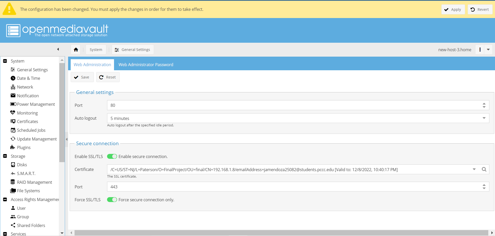

#
  
  ## How to build a File Server with Open-Media-Vault
  
 ## Table of Contents

 [How to build a File Server with Openmediavault](#how-to-build-a-file-server-with-openmediavault)
    - [Technology Definitions](#technology-definitions)
    - [Creating the Virtual Machine](#creating-the-virtual-machine)
- [Installing Openmediavault](#installing-openmediavault)
- [Configuring Openmediavault](#configuring-openmediavault)
- [Setting up a user account](#setting-up-a-user-account)
- [Setting up a group account](#setting-up-a-group-account)
- [SHH](#shh)
- [SSL](#ssl)
- [Taking this project further](#taking-this-project-further)
- [Conclusion](#conclusion)
- [Issues Encounter](#issues-encounter)
- [Works Cited](#works-cited)

## Technology Definitions

**What is Openmediavault?**
OpenMediaVault is a free Linux distribution created for network-attached storage. Openmediavault is based on the Debian operating system and is consent through the GNU General Public License v3.

**What is Secure Shell SSH?**
The SSH protocol (also referred to as Secure Shell) is a reliable remote login from one computer to another. It implements diverse choices for reliable authentication, and it shields communications security and integrity with strong encryption. 

**What is VirtualBox?**
VirtualBox is a general-purpose ample virtualizer for x86 hardware, targeted at server, desktop, and embedded use.

**What is the difference between NAT and BRIDGET adapter?**
NAT mode will hide all network motion as if it came from the Host OS, and Bridged mode replicates different node on the physical network, and the VM will receive it's own IP address if DHCP is enabled in the network.

**What is omv extras?**
Omv Extras is a plugin that enables the user to do several things. For example, Install backports kernel and install even more plugins. 

## Creating the Virtual Machine

**In the Name, field type any name you choose**

**Apply the default setting for the amount of base memory. In this case, the default value that I chose is 2048**

**Create a new virtual hard disk to use as our VM filesystem. So, use the default setting on this screen.**

**On the following screen, I select the format for the virtual hard disk. Here. I applied the default settings again. So, I would use the original VirtualBox Disk Image (VDI) format. Then, click Continue.**

**On the next screen, I needed to choose between a Dynamically Allocated or a Fixed-size virtual disk file. I picked the “dynamically allocated,” which is the default.**

**Then, choose the VM disk image file's location and maximum size on your host computer's file system.**

**Now you could see that I have a Debian 50 VM available in VirtualBox and it is in the Powered Off state**

 # Installing Openmediavault

**The initial installation screen of OpenMediaVault should appear on the screen. Pick Install from the boot menu and press the enter key to proceed.**

**On the following screen, choose the language utilized for the installation method, and default language for the installed system and press enter to proceed.**

**The subsequent screenshot decides the system location from the provided list depending on the geographical location - Continent -> Country- and press the enter key to continue.**

**On the subsequent screen, the next option will seem that will require to configure the network. Elect the initial network interface to be configured more and press the enter key to proceed. Then the network interface will be automatically configured via DHCP protocol.**

**Next, since the network has been configured with the proper IP settings, access the system hostname and press the enter key to advance to the next screen.**

**In this step, inscribe the domain to be used at the premises and press the enter key to continue.**

**A secure password must be set up for the root administrative account; repeat the identical password on the next screen and press enter to continue.**

**The package manager window will resemble on the screen. Elect a Debian mirror archive close to your physical location, press enter to continue.**

**To configure the Debian package manager’s access, the installer will demand proxy information. Likely, this is not a requirement, so leave it black and move forward.**

**Subsequent the installation concludes, remove the installation CD or USB and press enter to complete the installation and reboot the machine within the new operating system.**

**After rebooting the machine enter the username and password that it was set up earlier**

# Configuring Openmediavault

**In this screenshot after finding the IP address on the previous screen. The user needs to go to the web browser and type the IP address and it would take it to this website. To mention the username would be admin and password openmediavault.**

**After login, the following information will appear on the screen**

**After navigating to Storage -> File Systems, Hit on the Create button., Pick a file system type for the array, such as EXT4. Hit the OK button to perform the file system.**

**Choose the RAID device array from the file and hit on top the top-mount button to obtain the system's storage available. The apply button needs to be hit to save the changes.**

**After the previous step, now choose Shared Folders from the Access Rights Management menu at the right. by clicking the choice add, it will appear a busy dialogue box that seems like this.**

**Next, click the Shares tab—this where I configure the shared folders to show up when we access the NAS on the network. Click  Add, and a dialogue will appear.**

**Enables the shared folder in SMB**

# Setting up a user account

**Click Access right management, then click User and pick Add and add a new user using the following details.**

# Setting up a group account

# SHH

**SSH allows the user to practice the command line to access your NAS.**

# SSL

**SSL certificate s can be used for securing the web interface or SSH access**

**The following screenshot will show how to create an SSL certificate.**

**The following screenshot will display all usable packages that have to be upgraded, this would make the openmediavault more secure.**

# Taking this project further
 
**Why move file server to the Cloud?**

Move file server to cloud for greater helpful remote file access and cloud file sharing. Implement reliable remote access and mobile access to file server network shares with enhanced productivity and mobility.  There are many cloud platform that it can be used to create file server such as Microsoft Azure, Centre Stack, many others.

# Conclusion

Momentarily that you have learned how to build a File Server with OpenMediaVault, you can know how to make many useful things.  There are many options for taking this project further or making it useful for this project. For example, move the file server to the cloud.

# Issues Encounter
While working in this project, I encounter the following issues while I was trying to get my Ip Address

I Resolved this problem by doing the following commands:
* sudo ifup enp0s8
* ip addr
* dhclient -d enp0s8
  
# Works Cited 
* Ridwan. “Building an Open Media Vault NAS (Part 3— Configuring OMV).” Medium, 25 May 2018, ridwankhan.com/building-an-open-media-vault-nas-part-3-configuring-omv-ee15322602be.
  
* Emmet. “Installing OpenMediaVault to a Raspberry Pi.” Pi My Life Up, 13 Apr. 2020, pimylifeup.com/raspberry-pi-openmediavault.

* OnrGoLBD. “How To: Create SMB/CIFs/Windows Share in Open Media Vault (OMV).” Blog-D without Nonsense, 19 Apr. 2020, dannyda.com/2019/07/17/how-to-create-smb-cifs-windows-share-in-open-media-vault-omv.

* Techno Dad Life. “Enjoy Firefox Privacy and Security on Your Openmediavault Sever.” YouTube, uploaded by Techno Dad Life, 24 Aug. 2018, www.youtube.com/watch?v=3m0M4qpO978&feature=youtu.be.

* Admin. “Enable SSL/TLS Connection on OpenMediaVault Server.” Tutorial and Full Version Software, 29 Apr. 2016, gamblisfx.com/enable-ssltls-connection-on-openmediavault-server.

* “Openmediavault 5 Installation and Configuration on Virtualbox.” YouTube, uploaded by Techno Dad Life, 31 Oct. 2019, www.youtube.com/watch?v=q1lh4-ow9AM&feature=youtu.be.

