**Question 1**

**1.Display the content of the /etc/passwd file.**
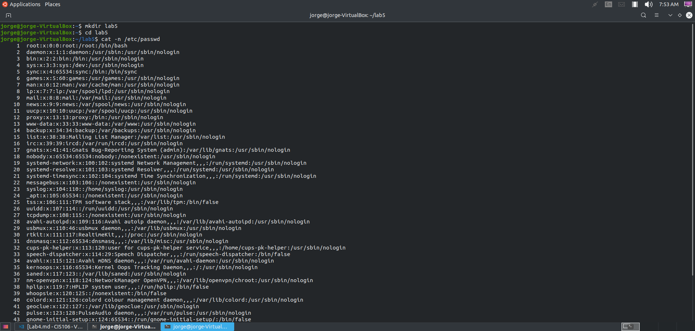
**2.Display the content of the /etc/passwd file in reverse order.**
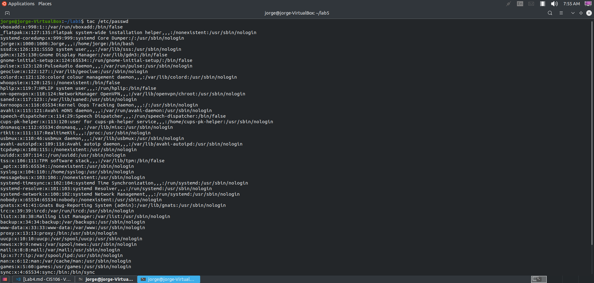
**3.Display the content of the /etc/passwd file with line numbers and the $ to indicate the end of every line.**
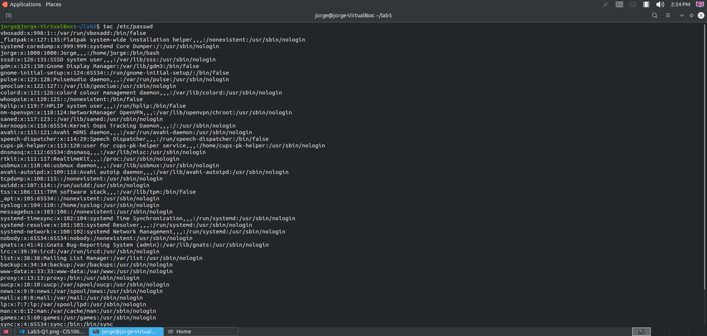
**4.Display the first 5 lines of a the /etc/passwd file.**
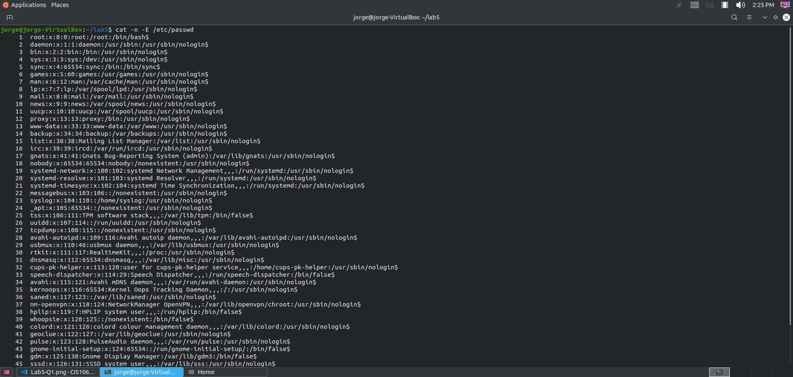
**5.Display the last 5 lines of the /etc/passwd file.**
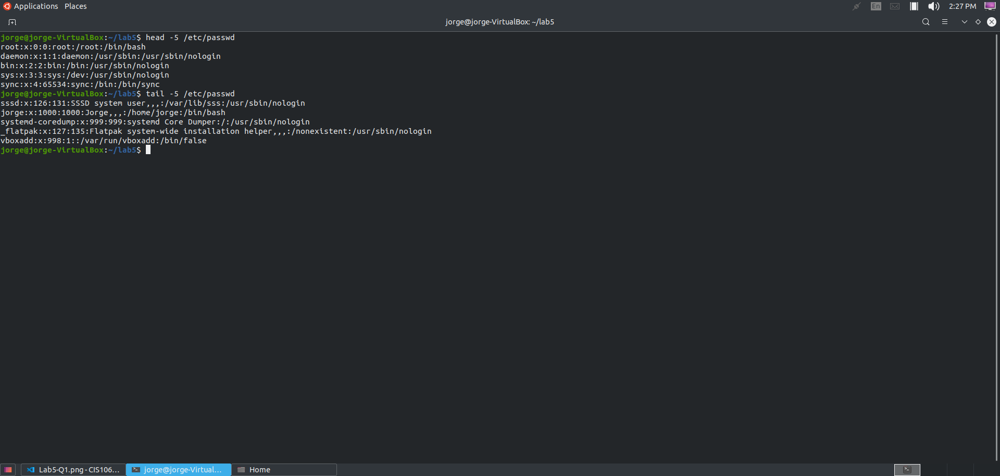

**Question 2**

**1.Display the first field of the /etc/passwd file.**
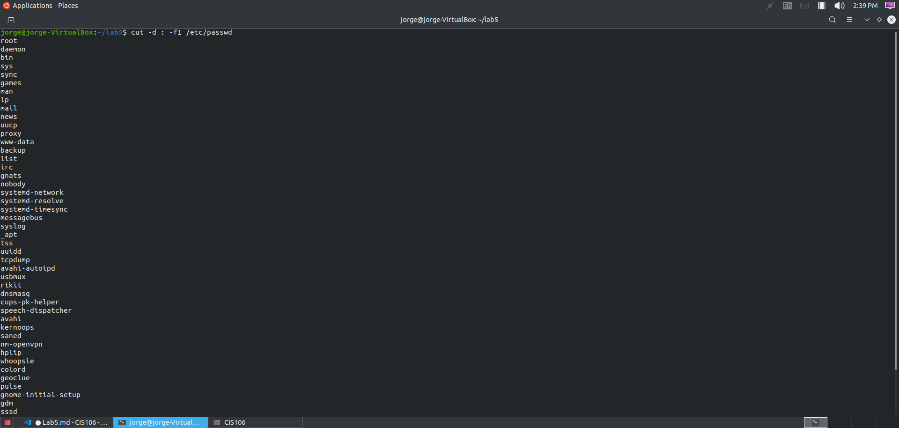
**2.Display the last 5 users in the /etc/passwd file.**
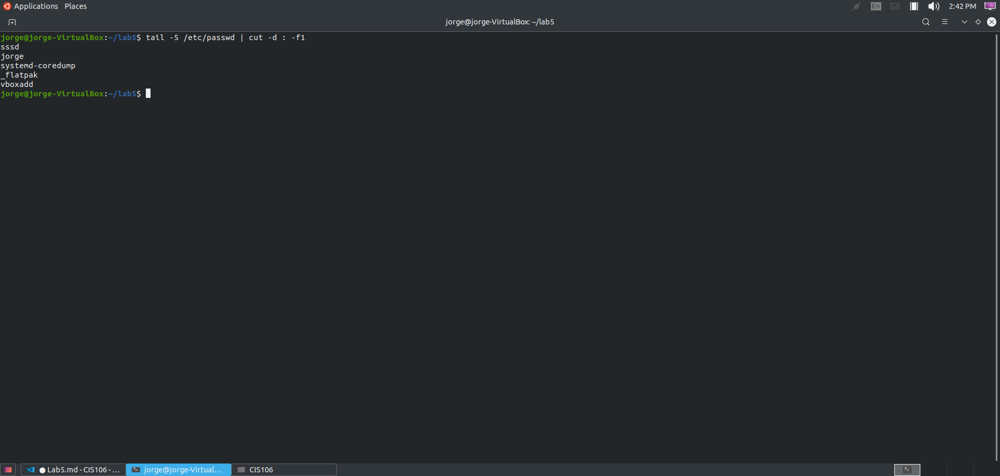
**3.Display a list of all the users and their designated login shell separated by an = sign.**
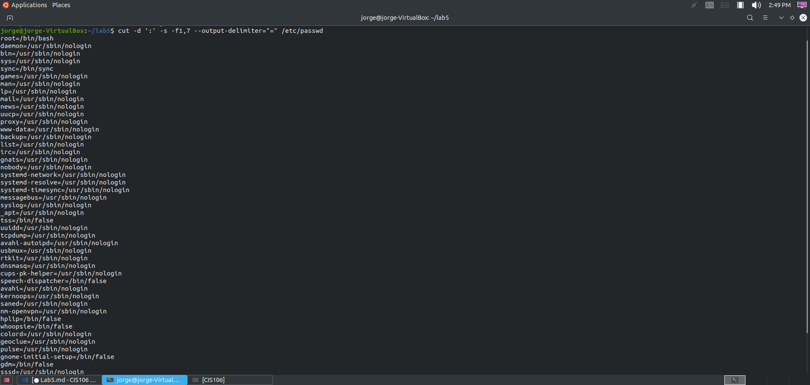
**4.The sort command is another amazing tool in any linux user’s tool box. Sort allows you to display data in a given order. Cut the first and 3rd field of the /etc/passwd field and sort the output.**
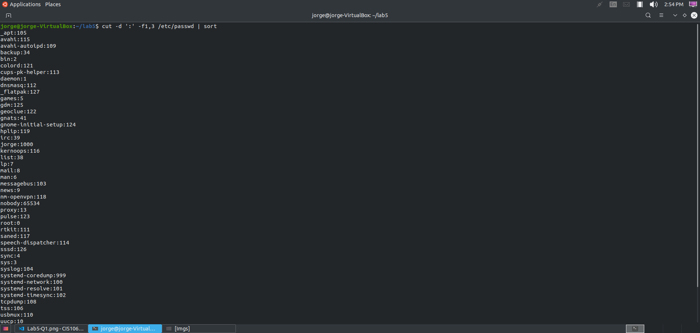
**5.Repeat the previous command but this time only show the last 5 entries.**
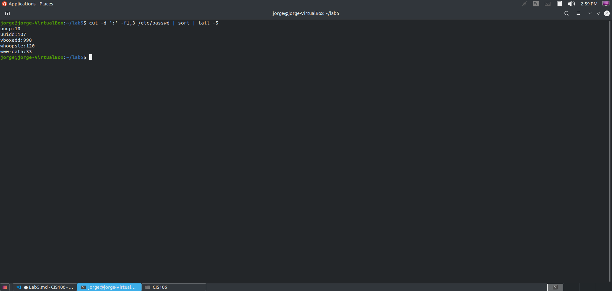

**Question 3**

**1.How many lines does the /etc/passwd file have?**
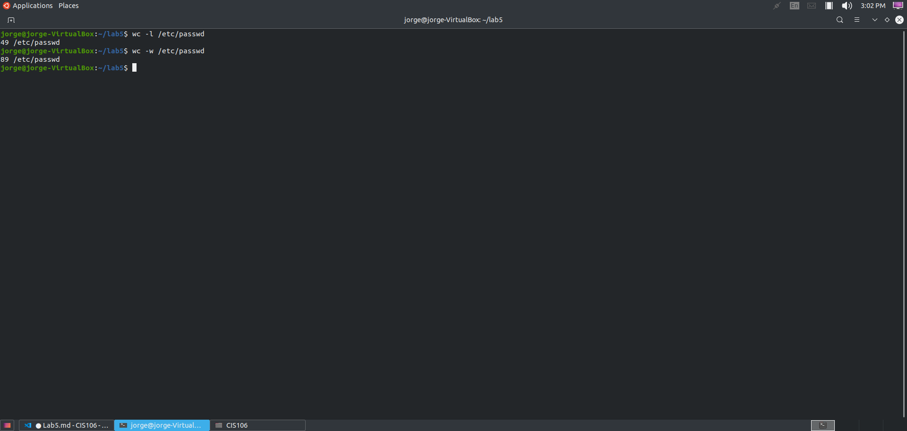
**3.How many users can login with the /bin/bash shell?**
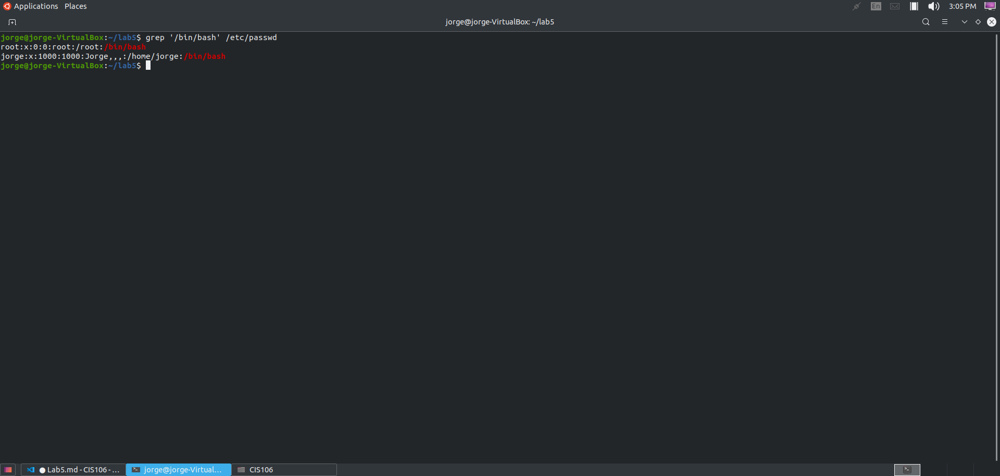
**4.How many users have the /sbin/nologin shell assigned?**
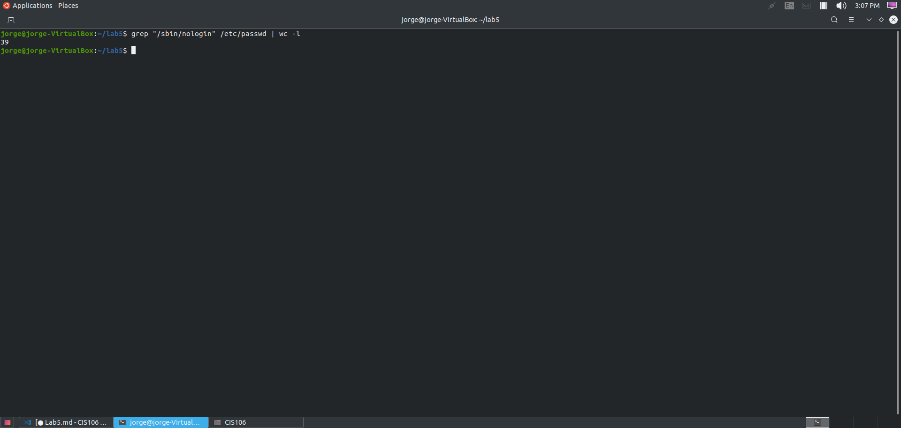
**5.Display your user’s information in /etc/passwd file**
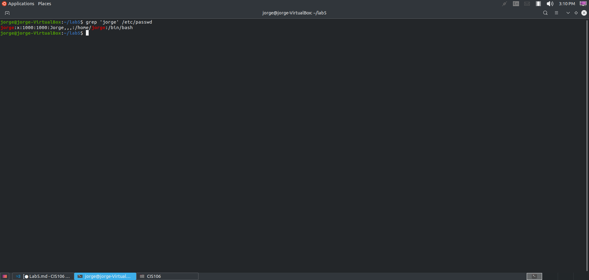

**Question 4** 

**Question 5**

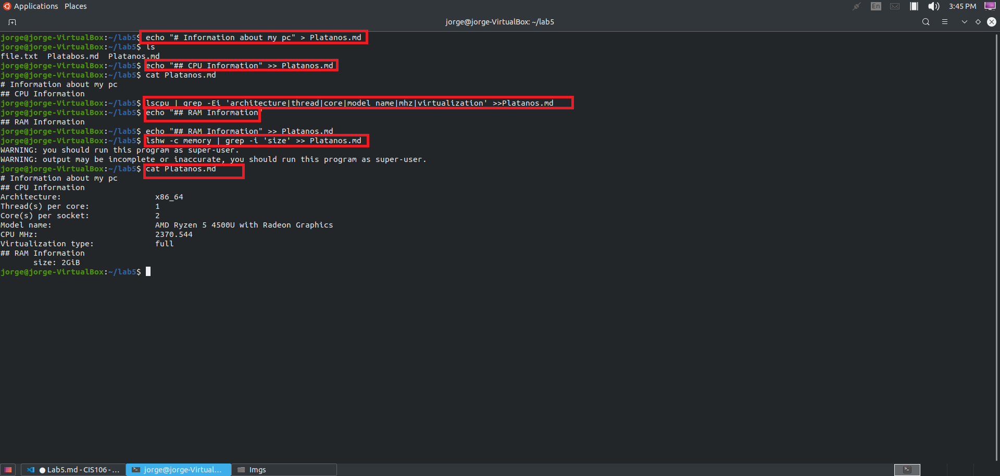