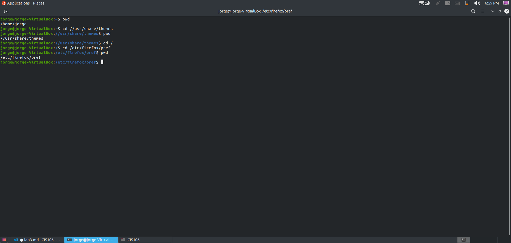

# Lab 3 | Installing software and navigating the file system | Answers
Assignment description [Installing software and navigating the file system](https://raw.githubusercontent.com/ra559/cis106/main/labs/lab3.md)

## Question 1
1. **Which command did you use to search for the themes and to install them?**
   
   to search for themes i used the command: apt search 'gtk theme'
   to install the theme i used the command: sudo apt install breeze--gtk-theme

2. **Which commands did you use to find and install the web browser?**
 
   to search for the web browser i used the command: apt search web browser
   to install the web browser i used the command: sudo apt install phantomjs

3.1 **What is the name of the package?** 

I used the command apt search steam 

3.2 **What dependencies are needed in order to install the package? (you can either take a screenshot of the terminal or copy and paste from the terminal)**

3.3 **How much disk space will the package utilize after installation?**

It's required 470 MB of additional disk space
 

## Question 2
**Answer 1-5**

**Answer 6-10**

## Question 3
**Answer 1-5**

## Question 4
**Answer 1-3**

**Answer 4**

**Answer 5**

## Question 5
**Answer 1-2**

**Answer 3-4**

**Answer 5**

