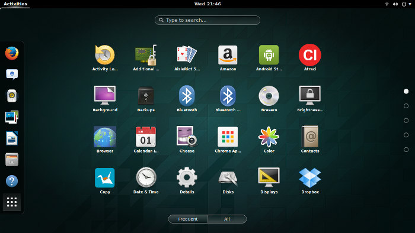
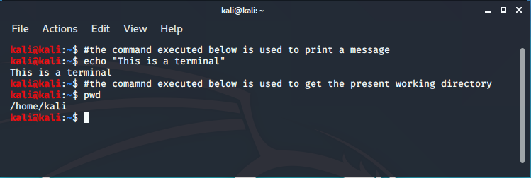
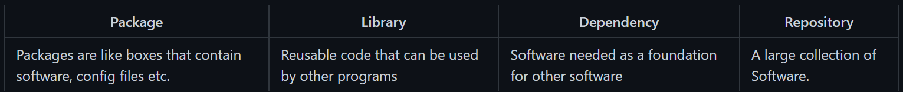
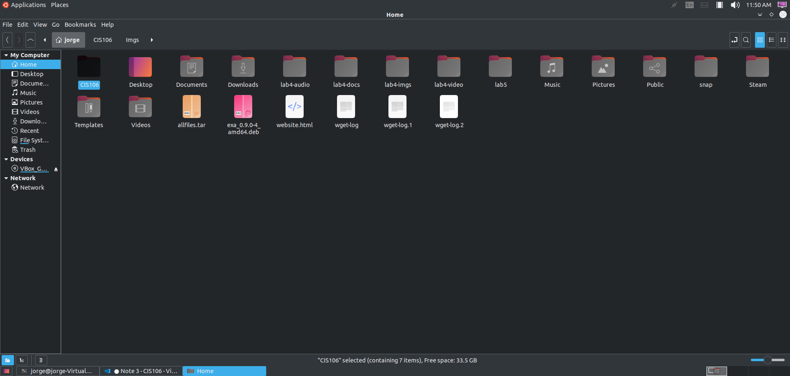
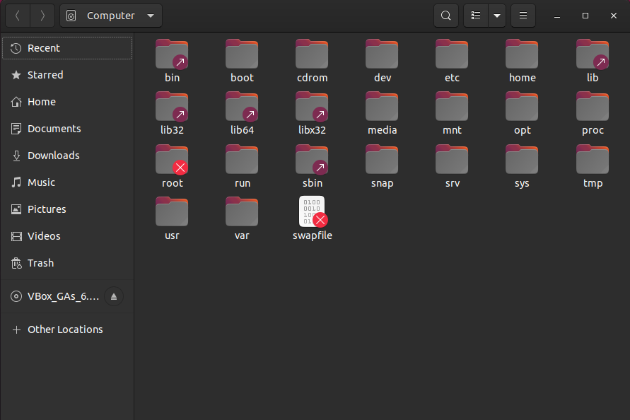
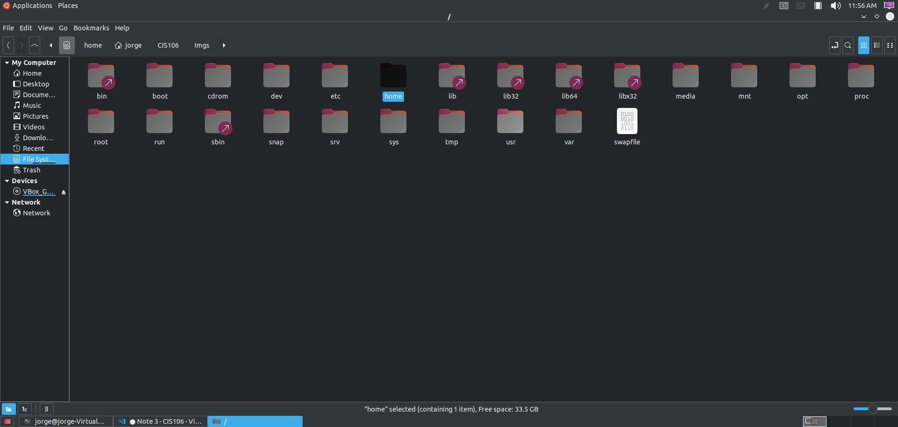

**Learning The Bash Shell**

**Exploring Desktop Environment Desktop Environment (DE)** is an implementation of the desktop metaphor made of a bundle of programs running on top of computer operating system, which shares a common GUI, sometimes described as a graphical shell. On windows and macOS the user is limited to a single GUI and DE. However, with Linux, the GUI choice are overwhelming and flexible. A DE provides a predetermined look and feel to the GUI.

During the 1980s and 1990s, the introduction of the Apple Macintosh and of Microsoft Windows on PCs saw the command line interface as the primary user interface replaced by the Graphical User Interface(The desktop environment is a GUI which is an implementation of the desktop metaphor)

There are many Graphical Desktops you can choose from. Most popular Graphical Desktops are

GNOME
KDE Windows and macOS users are limited to single Graphical User Interface and Desktop Environment while a Linux user has almost unlimited number of GUI choices.

To discuss the most common Desktop Environments

**What is a shell?** Shell makes largest-scale IT possible. They are necessary component to modern computing. The bash shell is shipped with almost every computer in the world. The Linux Terminal: CLI: the command-line interface is a means of interacting with a computer program where the user issues commands to the program in the form of successive lines. There are two ways to access CLI: terminal emulator, Linux console. The Bash Shell: The GNU bash shell is a program that provides interactive access to the Linux system. It runs as a regular program and is normally started whenever a user logs in into a terminal. Most Linux distributions use the bash shell as the default shell. However, other shells exist.

The Linux filesystem There are a lot of file managers option for Linux. The filesystem is like a tree where every branch represents a directory (folder). The directory where you are now is called current working directory or present working directory. In a filesystem, every file has a pathname which indicated the location of the files in the filesystem. Commands to move around the file: Pwd – used for displaying current working directory. Cd – used for changing directory.

CLI : A command-line interface is where the user commands to interact with the computer.
The shell is a program that takes commands from the keyboard and gives them to the operating system to process and perform.
On most Linux systems a program called bash👍acts as the shell program.

**What is a Terminal?**

It is a program which brings a new window in order to interact wih th shell and it is called terminal emulator. The terminal requires practice and is easy to learn but hard to master. 

Example:

**Managing Software**

Basic Terminology about using software in Linux.

* APT is a set of tools for managing Debian Packages
* SNAPCRAFT snaps are app packages for desktop, cloud and and IoT that are easy to instal, secure, cross-platform and dependency free.
* Flatpak is a next generation technology for packaging distributing and managing software in Linux.

**The Linux Filesystem**

File System: The way files are stored and organized. Directory and folder mean the same thing. Unlike windows Linux always have a single file system tree, regardless of how many drives or storage devices are attached to the computer. Commonly used File Manager. 

* **Nemo**

* **Gnome**

* **Thunar**

Think of the filesystem as a tree where every branch represents a directory(folder). Where you exactly are currently called the working directory. The directory backwards is called the parent directory and inwards is called subdirectory.

* A path is either relative or absolute. An absolute path always contains the root element and the complete directory list required to locate the file.
* A relative path needs to be combined with another path in order to access a file

